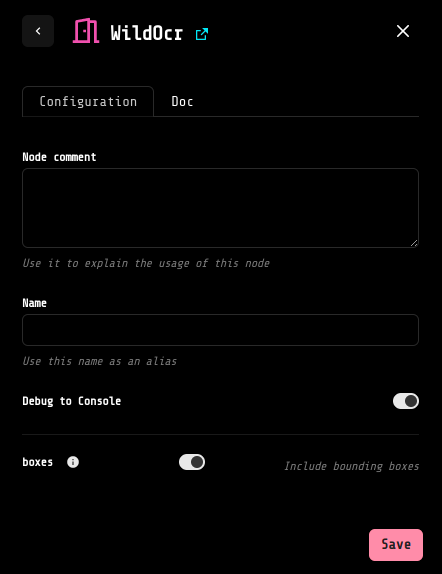
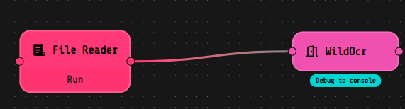
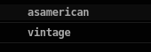
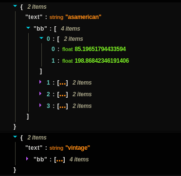

# WildOCR extension 📷

The WildOCR extension of LOKO AI, provide the homonym component, which allows you to detect and extract text "in the wild", particularly from images captured in real-world, uncontrolled conditions, where the text is presented in diverse and challenging formats.

## Usage 🚀

To use this component, follow these steps:

1. **Input Image:** Link a File Reader component to the WildOCR's `image` pin, providing the image from which you want to extract text.

2. **Output Options:** In the WildOCR component, specify whether you only need the extracted text as the result or both the text and the corresponding bounding boxes. You can do this by toggling the `boxes` field, if the latter option is the one you want to adopt, otherwise left this field untoggled. 

## Example 📝

Here's an example of how the WildOCR component fits into a workflow:

After the text extraction with WildOCR, you can use the output for several purpose, linking variuos components. 

When using this block in your use case, take in consideration the two types of output available:

 - **Text Only:** By default, the component will output a stream list of the extracted text.
 - **Text with Bounding Boxes:** If you toggle the `boxes` field, in the WildOCR block the output will consist of a stream of dictionaries, where the keys are "text" and "bb" (bounding box), and is a list of four coordinates. 
   !

## Installation 🛠️

You can install the WildOCR component from the Application section in LOKO AI. Enable it in your projects by clicking on the start buttons of the extensions.
